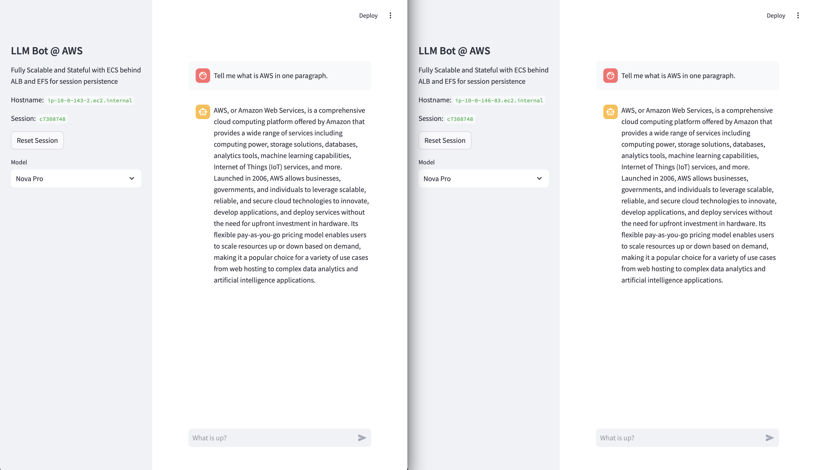
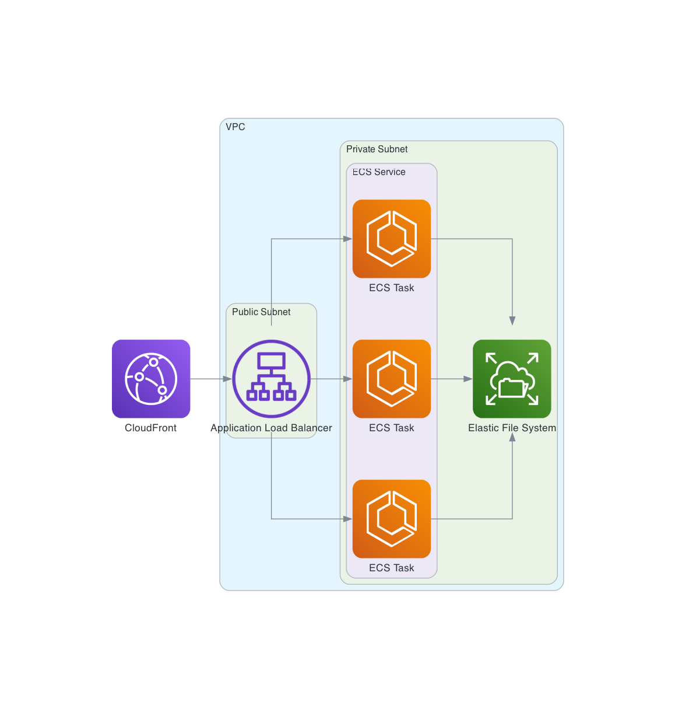

# scalable-stateful-streamlit-chatbot-on-aws

This is an example of a scalable and stateful Streamlit chatbot deployed on AWS, suing Application Load Balancer (ALB), Elastic Container Service (ECS on Fargate), and Elastic File System (EFS), and optionally CloudFront for CDN.

Unlike a typical Streamlit app, this chatbot can remember the conversation history across user refreshes and server restarts, as well as it's scalable across multiple ECS nodes, without adding too much cost (with an exception of the fixed cost of ALB).

Screenshot of the same session (as different browser tabs) served by different ECS Task nodes:

## Why?

Everyone uses Streamlit. Things are always working fine locally.

But when you want to deploy it to the cloud, you have to think about scalability and statefulness.

By default Streamlit is stateful in-memory. When either the user refreshes the page or the server restarts, the state is lost.

Putting it onto AWS ECS is a good start as it solves the scalability problem. But the statefulness problem remains.

So what's the solution?

First of all, the first part of the solution is to use the user's browser to store a session key in browser local storage with the package `streamlit-local-storage`. The native `st.session_state` is not enough because it's not persistent and not synced across multiple ECS Nodes by default. We need to persist the session data for every streamlit processing loop somewhere that could be shared across multiple nodes.

By default people would recommend you to setup a database, like RDS or DynamoDB, to store the state. But that's a lot of work and cost.

Using ElasticCache like Redis is another option, but it's not as easy to setup as you think, at least because of the security group settings. And again when the node restarts, the state is lost. You can't use it locally without a tunnel. And it's not scalable. Even though there is a serverless option, it's not as easy to setup as you think, and the storage cost comes with a minimal charge of 100MB/1GB.

Yes, you can also use S3 to store the state, but that also means every get/set operation will require a network call, though the cost is already low.

But to me, the ideal way is to persist the data into a directory itself, as with a proper setup, you can setup the persistancy with the same code across local and cloud environments.

Here EFS comes to rescue. It's a network file system that can be mounted to multiple ECS nodes. It's redundant across multiple AZs. It's scalable. It's easy to setup. And lastly it's cheap. If you want to have higher throughput you can use the Elastic throughput mode too.

## Pre-requisites

Infrastructure:

- A VPC
- Public and private subnets set
- NAT Gateway in public subnet, used by route tables of private subnets

Build Environment:

- Docker
- `awscli` installed and configured

## Deployment

1. Clone this repository
2. Deploy the CloudFormation stack in `template.yml`, preferrably with the UI.
3. Run `./deployment.sh` to build the Docker image and push it to ECR,
   and then it also updates the ECS service with the new image and sets the desired count to 1.
4. Access the chatbot at the URL of the ALB or at the CloudFront URL.
5. To make it truly scalable, you can set up Auto Scaling for the ECS service.
   It is not covered by the template in this repository.
